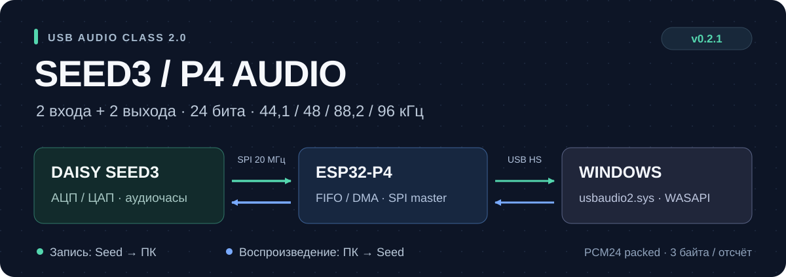

# ESP32-P4 · SPI ↔ USB Audio 2

[← Главная](../README.md) · [Подключение](../docs/wiring.md) · [Прошивка](../FLASHING_RU.md)

Проект ESP-IDF **5.5.5** для **ESP32-P4-WIFI6-Touch-LCD-7B rev1.x**.
Рабочий профиль v0.2.1: USB HS UAC2, **2 capture + 2 playback**, только
**24-битный packed PCM**, 44,1 / 48 / 88,2 / 96 кГц.

## Архитектура

[main/main.c](main/main.c) обслуживает проверенный SPI master на 20 МГц,
READY и управляющий UART. Seed задаёт аудиочасы. Компонент
[p4_uac2_stream](components/p4_uac2_stream/README_RU.md) переносит PCM
между кольцами приложения и USB: DMA, prefill, explicit feedback и восстановление
endpoint. PCM conversion выполняется в задаче, не в USB ISR.

[main/audio_dashboard.c](main/audio_dashboard.c) запускает официальный BSP
Waveshare и LVGL 9.5. Интерфейс обновляется отдельной задачей с низким
приоритетом: четыре peak-индикатора, CPU Seed3, отдельные частоты и состояния
capture/playback. Аудиозадачи передают только атомарные снимки значений.



| Интерфейс | Назначение |
| :--- | :--- |
| GPIO2 / 3 / 4 / 5 | SCLK / MOSI / MISO / CS |
| GPIO28 | READY от Seed |
| GPIO30 / 31 | RX / TX управляющего UART |
| USB-A J1 | USB HS аудио, только через data-only адаптер с разрывом VBUS |
| USB TO UART | Прошивка и консоль, сейчас COM6 |

Полная проводка и обязательные ограничения питания — [здесь](../docs/wiring.md).
Дисплей входит в профиль; Wi-Fi, SD и отдельная прошивка C6 пока отключены.

## Сборка и прошивка

Из этой папки на подготовленном стенде:

```powershell
.\build.cmd
.\flash.cmd COM6
```

Скрипт сборки активирует установленный ESP-IDF 5.5.5. Используется собственный
компонент `p4_uac2_stream`; зависимости зафиксированы в
[dependencies.lock](dependencies.lock). Готовые образы — в [firmware](firmware).

| Образ | Offset |
| :--- | :--- |
| `ESP32P4_Seed3_SPI_UAC2_2x2_Merged.bin` | **0x2000**, содержит всё необходимое |
| `bootloader.bin` | 0x2000 |
| `partition-table.bin` | 0x8000 |
| `seed3_p4_spi_uac2.bin` | 0x10000 |

Выберите merged-образ **либо** набор отдельных образов. `flash.cmd` уже
использует правильный offset и ROM `--no-stub` / 115200 baud.
Не обходите проверку ревизии через `--force`.

## Настройка и диагностика

На Windows используются `usbaudio2.sys` и WASAPI. Для смены sample rate
закройте оба потока. USB передаёт 3 байта/отсчёт; внутренний API — `int32_t`
PCM24 left-aligned. Запас устройства: `buffer 1|2|4` при закрытых потоках.

Экран хранит последнюю частоту открытия каждого endpoint отдельно. Поля
`capture_sample_rate` и `playback_sample_rate` доступны также через
`p4_uac2_get_stats()`. Они описывают выбор Windows, а `sample_rate` — текущий
общий физический rate Seed3. Разные сохранённые значения можно видеть
одновременно, но full-duplex без ресемплинга требует одинаковой частоты.

Ожидаемые признаки работы: `mounted=1`, `hs=1`, совпадение `rate` и `seed`,
отсутствие прироста CRC/sequence и ошибок USB в непрерывном потоке.
При старте/закрытии накопительные счётчики могут отличаться от нуля —
оценивайте их прирост отдельно от установившейся передачи.

[Финальные тесты, ограничения и настройка буферов](../docs/PCM24_ONLY_RU.md) ·
[Экран и телеметрия](../docs/DISPLAY_UI_RU.md).
