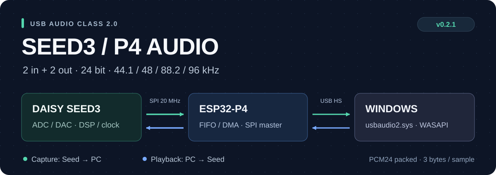
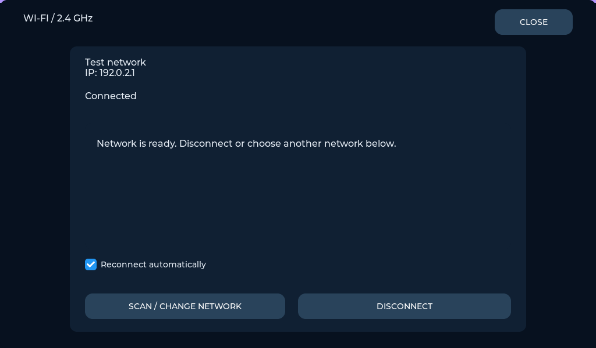
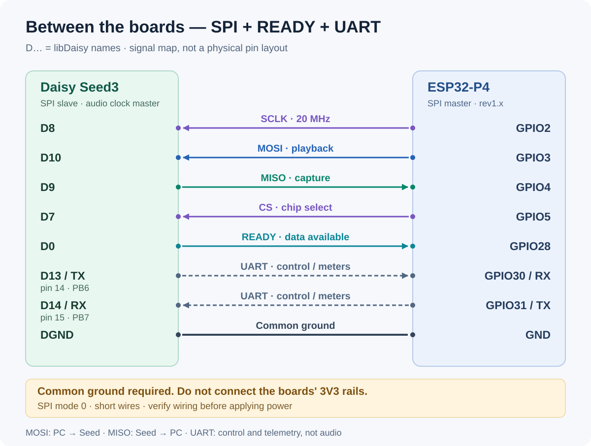

<p align="center">
  
</p>

<p align="center">
  <strong>A two-board audio interface with a touch-controlled pedalboard</strong><br>
  Daisy Seed3 DSP · ESP32-P4 display & USB High Speed · Native Windows UAC2
</p>

<p align="center">
  <a href="#pedalboard">Pedalboard</a> ·
  <a href="#wiring">Wiring</a> ·
  <a href="#quick-start">Quick start</a> ·
  <a href="docs/PEDALBOARD_GUIDE.md">User guide</a> ·
  <a href="README_RU.md">Русский</a>
</p>

## At a glance

Seed3 owns the ADC, DAC and audio clock. P4 handles USB, the 1024×600 touch
display and microSD. Local processing keeps running without a PC.

| Feature | Current implementation |
| :--- | :--- |
| USB audio | 2 capture + 2 playback, full duplex, UAC2 High Speed |
| Formats | **24-bit packed PCM**, 44.1 / 48 / 88.2 / 96 kHz |
| Windows driver | Built-in `usbaudio2.sys` |
| Inter-board audio | SPI mode 0, **20 MHz**, READY handshake, CRC and sequence checks |
| Pedalboard | 5-column snap placement, drag-only grid, up to 12 active nodes, Splitter and Mixer |
| Effect catalog | 40 DSP effects + 2 routing utilities; up to 4 controls per profile |
| Display | LVGL 9.5, direct socket patching, knobs, live ADC/DAC meters |
| Hardware | Daisy Seed3 + ESP32-P4-WIFI6-Touch-LCD-7B, **P4 rev1.x** |
| Toolchains | ESP-IDF **5.5.5**, DaisyToolchain + libDaisy |

USB uses three bytes per sample. SPI and the component API retain the tested
`int32_t` representation with 24 valid left-aligned bits. The current profile
does **not** advertise 192 kHz.

## Pedalboard


*Native LVGL test render — example graph and simulated meter values, not a photo.*

- **Tap a socket, then a free opposite-direction socket** to connect.
  Start from either end; the selected pedal and socket light up.
- **Tap a connected socket, then empty board space** to unplug its wire.
- An occupied second socket cancels the action. Internal wires have distinct
  colors; **IN1/OUT1 stay green, IN2/OUT2 stay blue**. Parallel tracks do not
  overlap; the pedal field scrolls vertically while **physical sockets and meters stay fixed**.
  Use **Splitter** for branches and **Mixer** to combine them.
- Tap the large **top LED** to toggle a pedal; tap its body for rotary controls.
  Tap **Done** or outside the editor to close it.
- Hold empty board space, choose a **category**, then an effect to add it there;
  uncategorized effects are in **Other**.
- Hold a pedal for **0.5 seconds, then move outside its body** to reposition it.
  A white outline shows when it is ready. Hold **1 second inside its body**
  for replace, delete or information.
  Finger movement within the card does not start a drag.
  Drop into an **empty cell**, including lower rows; occupied cells swap pedals if both fit.
  The target is highlighted, and holding near the top/bottom edge scrolls the field.
- The **5-column grid is hidden at rest**. It appears only while dragging,
  through the last occupied row plus **one extra row** below, not the whole field.
- Cards share a rounded rectangular shape: **104×198**, or **264×198** for
  a two-cell Cabinet Sim. Wide cards reserve two neighboring cells. Color-tinted
  fills by effect type. Flat 2D styling: no shadows, textures or idle animations.
  No instance numbers or separate bypass buttons. Routing does not change when a card moves.
- Hold **AUDIO SETTINGS** for the shared sample rate and channel switches.
  Disabled physical channels disappear from the board.
- Vertical meters beside the physical sockets show **Seed3 ADC input and final
  DAC output**, including local operation with no USB stream and while the field scrolls.


**[Read the illustrated guide →](docs/PEDALBOARD_GUIDE.md)** ·
[Русская инструкция](docs/SEEDFX_ROUTING_RU.md)

## Wi-Fi settings

Open **SETTINGS → WI-FI** to scan 2.4 GHz networks and enter a password on the
touch keyboard. Reopening the page shows connection status and the assigned IP.
You can disconnect, select another network and enable **Reconnect automatically**.
Credentials are saved on the device, never in this repository.



*Native LVGL render with simulated network data.*
[Network setup and limitations](docs/WIFI_SETTINGS.md)

The routing graph is applied between audio blocks. Disconnected branches are
not processed. Current screen edits live in RAM; restarting reloads
`AUTORUN.SFG` and resets visual placement. The 40 placement cells do not raise the
12-active-node DSP limit. Saving a preset from the touchscreen is not implemented yet.

## Wiring

> [!WARNING]
> **Check power before connecting the boards.** Use a common ground, but do not
> connect the boards' 3V3 rails. Connect P4 **USB-A J1** to the PC only through
> the verified data-only adapter with **VBUS physically disconnected**.
> Never use an ordinary USB-A to USB-A cable.



This is a **signal map**, not a physical connector layout.

| Signal | Daisy Seed3 | ESP32-P4 | Direction |
| :--- | :--- | :--- | :--- |
| SPI SCLK | D8 | GPIO2 | P4 → Seed |
| SPI MOSI / playback | D10 | GPIO3 | P4 → Seed |
| SPI MISO / capture | D9 | GPIO4 | Seed → P4 |
| SPI CS | D7 | GPIO5 | P4 → Seed |
| READY | D0 | GPIO28 | Seed → P4 |
| UART Seed TX | D13 / PB6 · physical **pin 14** | GPIO30 / RX | Seed → P4 |
| UART Seed RX | D14 / PB7 · physical **pin 15** | GPIO31 / TX | P4 → Seed |
| Ground | DGND | GND | Common |

Physical pins **14/15** are libDaisy **D13/D14**, not D14/D15.
UART carries graph commands, diagnostics and CRC-protected physical level
telemetry. Audio stays on SPI. Keep SPI wires short; the older I²S wiring is
not used.

| USB connector | Purpose |
| :--- | :--- |
| P4 **USB-A J1** | Bidirectional audio, via the data-only adapter above |
| P4 **USB TO UART** | Flashing and console; `COM6` on the development bench |
| Seed3 **USB** | ROM DFU firmware update, not the PC audio interface |

[Detailed wiring and power notes (RU)](docs/wiring.md)

## Quick start

### 1. Flash both boards

Ready-to-flash images and SHA-256 files are included:

| Board | Image | Address |
| :--- | :--- | :--- |
| Seed3 | [Seed3P4SpiAudio.bin](Seed3/firmware/Seed3P4SpiAudio.bin) | `0x08000000` |
| P4 rev1.x | [Merged image](ESP32-P4-WIFI6-Touch-LCD-7B/firmware/ESP32P4_Seed3_SPI_UAC2_2x2_Merged.bin) | **`0x2000`** |

Close audio applications and serial monitors. On the configured Windows host:

```powershell
# Seed3: hold BOOT, briefly press RESET, then release BOOT.
# A running compatible firmware can also enter DFU through "seed boot".
.\Seed3\flash.cmd

# P4: connect USB TO UART; substitute your actual port.
.\ESP32-P4-WIFI6-Touch-LCD-7B\flash.cmd COM6
```

Seed3 starts automatically after a successful write. **Do not use
`esptool --force`**: the P4 image is built for rev1.x.
[Tool installation, build paths and recovery (RU)](FLASHING_RU.md)

### 2. Prepare microSD

Copy **the folder `SEEDFX` inside [microSD-ready](microSD-ready)** to the root
of a FAT32 card, then insert it into the P4 board:

```text
microSD root/
└── SEEDFX/
    ├── index.json
    ├── AUTORUN.SFG
    ├── effects/       # effect packages and editable JSON definitions
    └── presets/       # graph packages and editable JSON definitions
```

The reader uses the onboard 4-bit SDMMC interface and validates package CRCs.
The initial preset is two direct input-to-output wires. Refresh/restart after
changing card contents. The current catalog limit is 64 entries.

> [!NOTE]
> Current `.sfx` packages select **built-in DSP implementations** and their
> parameters. They are not executable modules loaded from SD. A native module
> loader is a separate, unfinished feature; see the
> [module architecture plan (RU)](docs/SEEDFX_NATIVE_MODULES_PLAN_RU.md).
> No claim of support for thousands of loadable native effects is made here.

### 3. Choose the audio format

Open `mmsys.cpl` and select **2 channels, 24 bit** for both recording and
playback. Supported rates are 44.1, 48, 88.2 and 96 kHz.
Stop both streams before changing rate, then choose the **same rate** for both.
Exclusive WASAPI applications select their own format.

All screens show the same confirmed Seed3 hardware rate. With a PC connected,
Windows owns the shared clock; local rate selection is locked. Disconnecting
the audio USB restores the local profile and enables the pedalboard.

Swipe down from the top to switch **MONITOR / PEDALBOARD / SETTINGS**.
Automatic page switching on PC connect/disconnect can be disabled in Settings.

## Latency and resource use

| Transport | Block geometry | Intended use |
| :--- | :--- | :--- |
| **BALANCED** | 32 frames up to 48 kHz; 64 at 88.2/96 kHz | Default |
| **LOW LATENCY** | 32 frames at every supported rate | Lower block latency, more CPU work |
| **LOCAL** | No SPI audio; control/telemetry only | Automatic while USB streams are closed |

USB service interval is 0.5 ms. Device buffering is selected separately with
`buffer 1`, `buffer 2` or `buffer 4` while streams are closed. The host
buffer is chosen in the DAW/WASAPI application; it is **not** end-to-end latency.

LVGL allocations use P4 PSRAM, preserving internal DMA memory for transport.
Seed reserves 62 MiB of SDRAM for the resource arena and two graph delay banks.
Audio callbacks do not allocate memory or perform storage I/O. Hidden pages
do not redraw their level meters.

[Transport modes and measurements (RU)](docs/TRANSPORT_MODES_RU.md) ·
[Graph format and memory layout (RU)](docs/SEEDFX_NODES_RU.md)

## Build and test

```powershell
.\Seed3\build.cmd
.\ESP32-P4-WIFI6-Touch-LCD-7B\build.cmd

# Native LVGL, graph/DSP and physical-meter tests:
$env:SEEDFX_ZIG = 'C:\Tools\zig\zig.exe'  # Windows x86_64 Zig 0.14.1
python tools/host/build_tests.py
python tools/test_seedfx_pack.py
```

LVGL dependencies are installed by the P4 build.
[Host-test setup and scope](tools/host/README_RU.md) ·
[Latest direct-patching verification](docs/PEDALBOARD_DIRECT_PATCH_TEST.md)

Historical USB qualification on 18 September 2026 included 100 capture
open/close cycles and a 301-second, 96 kHz full-duplex run with no new CRC or
sequence errors. These results belong to that firmware snapshot, not a new
qualification of every later UI build.
[Historical report](docs/PCM24_ONLY_RU.md)

## Project map

| Directory | Responsibility |
| :--- | :--- |
| [Seed3/src](Seed3/src) | ADC/DAC, clock ownership, DSP graph and physical meters |
| [P4 components](ESP32-P4-WIFI6-Touch-LCD-7B/components) | USB, SPI, control, display, PSRAM allocator and microSD reader |
| [protocol](protocol) | Shared audio, graph, port and telemetry definitions |
| [microSD-ready](microSD-ready) | Ready-to-copy catalog and presets |
| [docs](docs) | Wiring, user guides, architecture and test reports |
| [tools](tools) | Package builder, native tests, WASAPI tools and diagnostics |
| [libraries](libraries) | Historical transport library snapshots |

The active USB component is
[`p4_uac2_stream`](ESP32-P4-WIFI6-Touch-LCD-7B/components/p4_uac2_stream).
Historical copies are not replacements for the current integration.

**Current limits:** 12 active nodes, up to 48 graph wires, 64 catalog entries,
no user feedback loops, no native SD module loader, no on-screen preset save.
USB capture remains the raw ADC signal; USB playback is mixed by the existing
output path. USB endpoints are not separate graph nodes. Wi-Fi uses the onboard
ESP32-C6 with compatible ESP-Hosted firmware; no web server or remote effect
control is enabled by this change.
