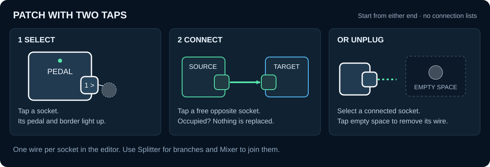
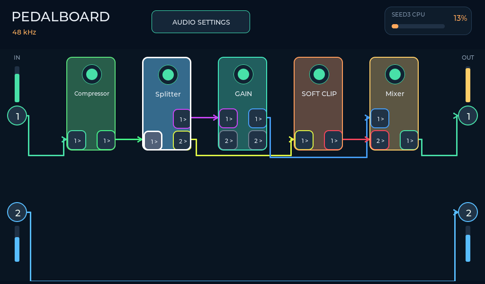
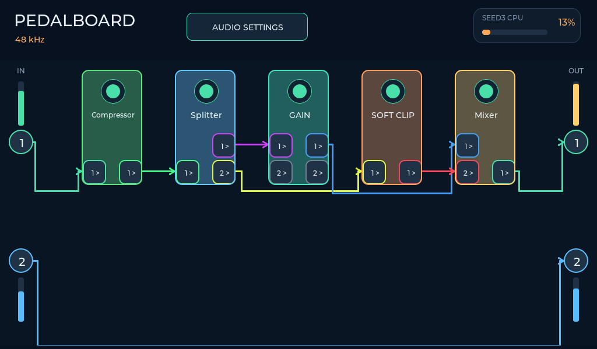
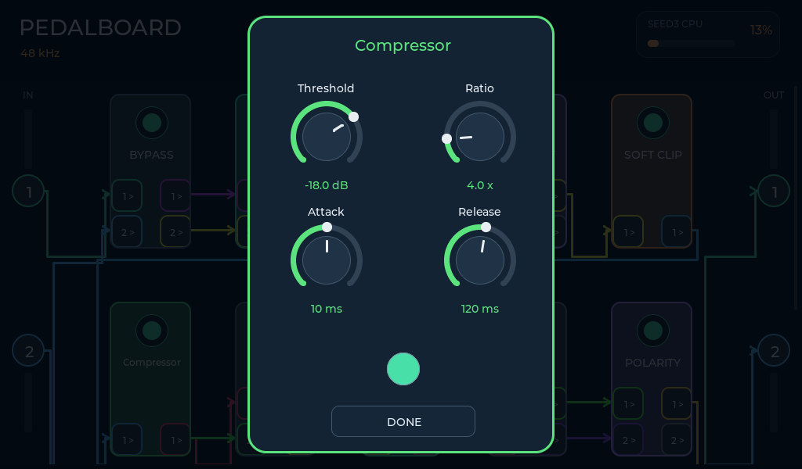
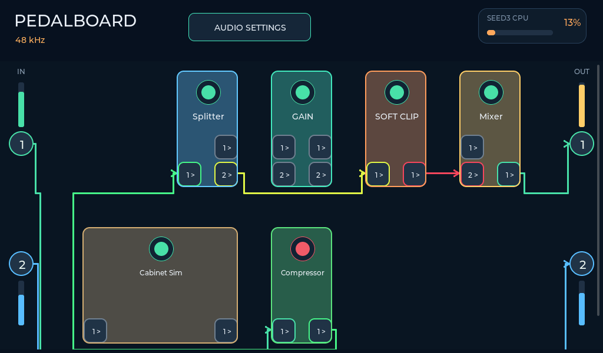
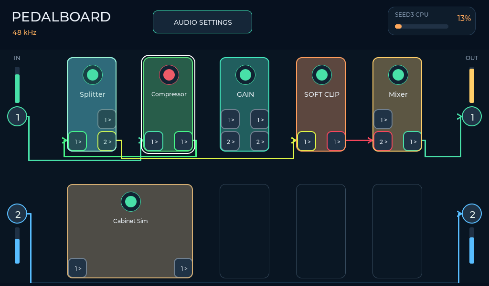
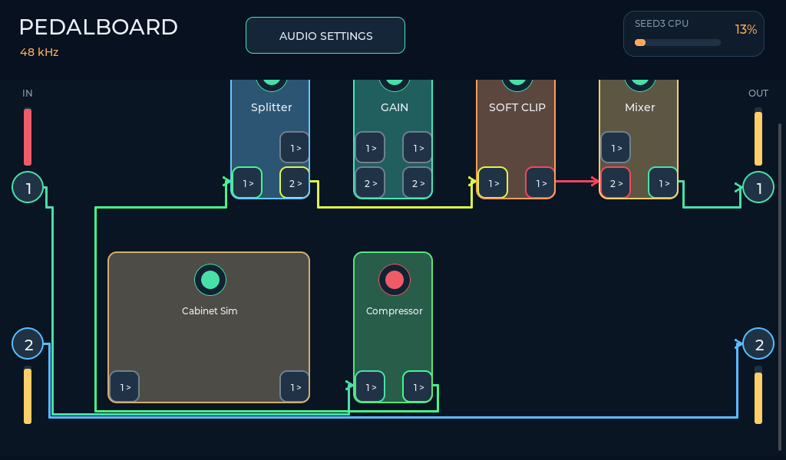
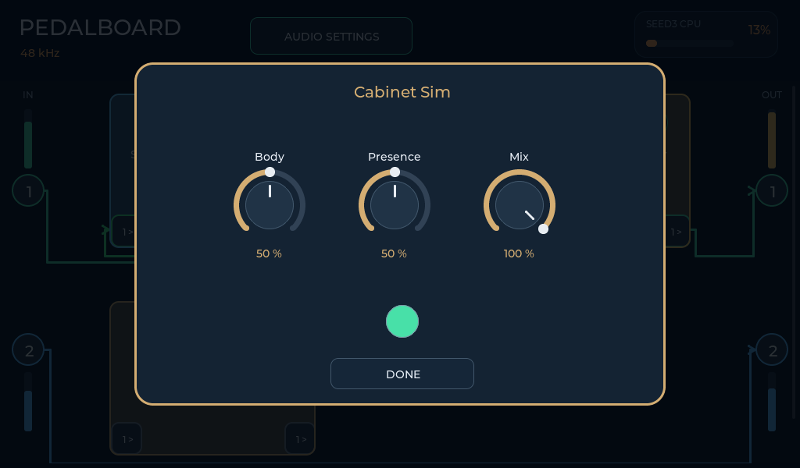
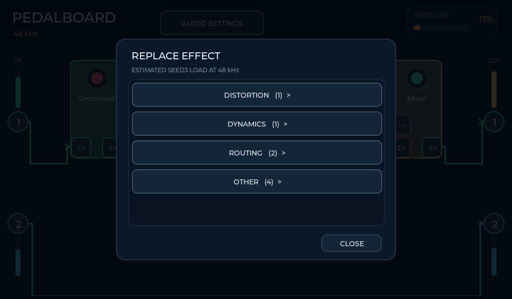

# Pedalboard guide

[Home](../README.md) · [Русский](SEEDFX_ROUTING_RU.md)

## Connect by touching sockets



1. Tap an **output** socket. Its border and its pedal light up.
2. Tap the destination **input** socket. A colored arrow joins them.
3. You can start at the input instead: tap the input, then the source output.

The physical INPUT buttons on the left are **sources**. The physical OUTPUT
buttons on the right are **destinations**. A pedal can have one or two sockets
on either side according to its mono/stereo profile. Each wire carries one
channel; stereo connections require two wires.



*Host render, illustrative graph and meter values.*

Only a free source and a free destination can be connected. An occupied
second socket, two inputs, two outputs, a self-connection or a feedback cycle
cancels the attempt without replacing an existing wire. Tap the same socket
again to cancel selection. There are no source/destination lists.

For a new pedal in the initial dry path, **unplug the dry wire first**.
Adding a pedal does not automatically move any wires.

## Remove or reroute

Tap either end of an existing wire, then tap **empty board space**. Only that
wire is removed. To reroute, remove it and make a new connection. Empty-space
tap on a selected unused socket simply cancels selection.

The UI creates one wire per socket. Use a **Splitter** to send one signal down
two paths. Old imported presets may have multiple destinations for one output:
remove those wires by their individual destination inputs. Selecting that
shared output and tapping empty space will not delete all branches.

Physical connections have permanent colors: **IN1 / OUT1 = green**,
**IN2 / OUT2 = blue**, independent of graph order. Internal pedal-to-pedal
wires use distinct colors that stay stable while other wires are edited.
Matching borders identify sockets; arrowheads show direction. A direct
IN1 → OUT2 or IN2 → OUT1 cross-patch changes color at mid-span to preserve
both physical endpoint colors. Internal colors are UI state, not preset data.

Parallel runs use separate tracks, with no reused overlapping horizontal
lanes. Perpendicular crossings are allowed and are **not junctions**.
Wires run through row gutters and outside buses, clear of wide pedal bodies.
The field grows with occupied rows and becomes vertically scrollable.
The top controls and physical I/O remain fixed; swipe within the board
to reach its lower rows. Swipe down from the top header to open the window menu.

## Parallel paths and independent channels



- **Splitter:** one mono input, two identical mono outputs.
- **Mixer:** two mono inputs, one mono output:
  `OUT = (A × Branch A + B × Branch B) × Master`.
  Defaults are 50% + 50%, with Master at 100%. Bypass passes A only.
- INPUT 2 can feed an entirely independent chain ending at OUTPUT 2.
- To split and combine stereo, use two Splitters and two Mixers, one per channel.

Mixer is not a limiter. High branch gains can clip the final output.
Effect latency and phase shifts between parallel branches are not
automatically compensated.

## Edit a pedal

Hold empty board space to open the effect categories, then select a category
and a pedal. **Other** contains uncategorized/utility effects. **Back** returns
to categories without losing the add/replace action. Added pedals start
unconnected, at the selected cell when their footprint fits; otherwise the
first fitting free space is used. Tap the **large top LED** directly on the card to toggle processing
without opening its editor. The LED is green when enabled and red in bypass.

Tap the pedal body to open its controls:



Turn the knobs, then tap **Done** or anywhere **outside the editor card**.
Both close the editor; edits already made remain applied. Touching the card
itself or its knobs does not dismiss it.

Hold a pedal **1 second with the finger inside its body** for **EDIT**, **REPLACE**, **INFORMATION** or
**DELETE**. Information contains the CPU estimate and profile details.
Deleting a pedal removes only its own wires; neighbors are not reconnected.

Hold **0.5 seconds, then move outside the original card bounds** to reposition
a pedal. Motion inside the card still counts as holding. A preview follows your
finger, while a highlighted cell shows the drop target. Release to place it in
that cell, including empty cells below or beside other pedals. An occupied
target swaps the two cards **only if both footprints fit**. A red target marks
an invalid placement, which is cancelled on release. Wide cards cannot cross
a row boundary or overlap a third card. The five-column grid snaps cards into
nonoverlapping positions and reroutes the drawing. **Audio wiring,
DSP order and node IDs do not change.** Releasing outside the board cancels.
A white outline appears at 0.5 seconds to show the card is ready to move.
Leaving the card before 0.5 seconds cancels the hold; do not stay inside past
1 second if you want to move. Scroll by swiping **empty board space**.
The grid is **invisible at rest**. During a drag, guides cover the occupied
rows and **one additional row** below, up to the eight-row capacity. Hold near
the top/bottom edge to auto-scroll. Placing a pedal in the extra row expands
the board; the next drag offers one more row, not all remaining rows at once.
Positions are RAM-only and reset on reboot.





Cards are **104×198 rounded rectangles**. Cabinet Sim spans **two adjacent
cells** with a 264×198 body; its shape, height and corner radius stay consistent. Their
flat color-tinted fills distinguish effects from the dark board. No shadows,
textures, instance-number labels or separate ON/BYPASS buttons are used.
The 40 view cells do not change the limit of **12 active DSP nodes**.

**Only the pedal field scrolls.** IN1/IN2, OUT1/OUT2 and their live meters
stay fixed at the screen edges. Cables stay attached to those fixed sockets;
scrolling updates their geometry without recreating the cable objects.





Cabinet Sim currently has **three real DSP controls: Body, Presence and Mix**.
It is a simplified cabinet filter, not an IR loader or a modeled amplifier.
The current protocol supports up to four parameters per processor; a full
amplifier model with more controls requires a separate DSP/protocol extension.
No decorative controls or unimplemented amplifier effects are advertised.



## Audio settings and meters

Hold the top **AUDIO SETTINGS** button for channel switches and sample rate.
The physical INPUT/OUTPUT buttons are 42×42 pixels; pedal sockets are 40×42,
positioned in the lower portion of the card. The toggle LED is 42×42.
Disabled physical sockets and their meters disappear. Their saved wires are
hidden, not erased, so re-enabling a channel restores them.

The four vertical bars next to the physical sockets display peaks from Seed3:

- left: ADC channels 1 and 2, before local effects;
- right: final DAC channels 1 and 2, after effects and the existing USB mix;
- a 60 dB display range, channel 1 green / channel 2 blue, yellow near the top and red at high level.

These are physical levels, not a duplicate of the USB monitor. They work with
no PC stream. Seed sends CRC-protected telemetry over UART at up to 25 Hz;
SPI audio framing is unchanged. The meter display decays and only updates
while the pedalboard is visible. USB monitor meters keep their existing
capture/playback meaning.

All pages use the same confirmed Seed3 sample rate. With the PC connected,
Windows controls that rate and the local selector is locked. With no PC,
the pedalboard stays enabled and uses its local rate.

## Persistence and limits

- Up to **12 active nodes**, including Splitter and Mixer.
- No graph feedback loops. Use an effect's feedback knob instead.
- Unconnected outputs are silent; a new empty preset contains explicit dry wires.
- Branches that cannot reach an enabled output are not executed.
- Topology changes reset graph state; parameter changes preserve delay tails.
- Screen edits are currently **RAM-only**. Reboot reloads the card's
  `SEEDFX/AUTORUN.SFG`; there is no on-screen Save yet.
- The graph routes **Seed3 ADC → DSP → DAC**. USB capture stays raw ADC;
  USB playback uses the existing mix, not separate editable graph endpoints.
- SD effect files currently choose built-in processors. Executable SD modules
  remain a separate implementation task.

For persistent presets, edit the JSON definitions in
`microSD-ready/SEEDFX/presets` and rebuild packages:

```powershell
python tools/seedfx_pack.py --root microSD-ready/SEEDFX
```

Copy the updated SEEDFX directory to the card. Format, graph versions and
memory details: [SeedFX reference (RU)](SEEDFX_NODES_RU.md).

## Implementation map

| Module | Role |
| :--- | :--- |
| `p4_audio_dashboard/pedal_patch.*` | Pure two-tap state machine, safe unplug and persistent wire-color slots |
| `p4_audio_dashboard/pedal_layout.*` | Bounded orthogonal router, separate parallel tracks and adaptive canvas height |
| `p4_audio_dashboard/pedalboard_widgets.*` | Rotary controls and pedal-specific widgets |
| `p4_audio_dashboard/pedal_categories.h` | Categories and guaranteed Other fallback |
| `p4_audio_dashboard/pedal_gesture.h` | 0.5 s + exit card to drag / 1 s inside card for context |
| `p4_audio_dashboard/pedal_grid.*` | Stable-ID cell placement, holes, move/swap and hit testing |
| `p4_audio_dashboard/wifi_view.*` | Network list, keyboard and connection view |
| `p4_wifi_settings` | Serialized nonblocking requests, ESP-Hosted and NVS credentials |
| `protocol/seedfx_routing.h` | Topology validation, stable node IDs and connection edits |
| `p4_audio_control` | Authoritative graph, command queue and revisioning |
| `Seed3/src/seedfx_graph.*` | Active/staging DSP graph, reachability and block-boundary updates |
| `Seed3/src/seed_level_meter.*` | Physical peaks and bounded, nonblocking foreground UART TX |
| `protocol/seed_meter_protocol.h` | Shared ASCII/CRC peak telemetry format |

[Verification report](PEDALBOARD_DIRECT_PATCH_TEST.md)
