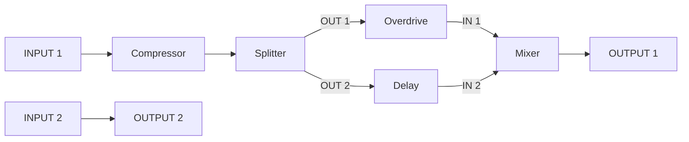

# Маршрутизация педалборда

## Как подключать

1. Удерживайте пустую область и добавьте нужные педали. Они появляются без
   проводов: существующий звук и соединения не перестраиваются автоматически.
2. Тапните по свободному выходу, затем по свободному входу: появится провод.
   Можно начать с входа и затем выбрать выход. Выбранная педаль и разъём
   подсвечиваются. Физические INPUT слева — источники, OUTPUT справа — получатели.
3. Занятый второй разъём отменяет действие без замены связи. Повторный тап
   по тому же разъёму также отменяет выбор. Списков источников/получателей нет.
4. Для удаления тапните по любому концу провода, затем по пустому месту.
   Чтобы поменять маршрут, удалите старую связь и создайте новую.
5. Для разветвления добавьте Splitter, для объединения — Mixer.
   В новой схеме один провод на разъём. Старые импортированные fan-out-схемы
   принимаются: удаляйте их ветки через отдельные входы-получатели.
   Тап по общему выходу и пустому месту не удаляет сразу несколько веток.


Это рендер тестовой схемы; значения индикаторов заданы тестом, не измерены
на аналоговом входе. Разъёмы по краям увеличены до 42×42, на педалях — 40×42
и опущены ниже. Лампа включения сверху — 42×42; отдельных кнопок и номеров нет.

Цвета физических каналов постоянные: **IN1/OUT1 зелёные, IN2/OUT2 голубые**.
Внутренние связи между педалями имеют отдельные цвета, сохраняемые при
редактировании соседних связей. У прямого перекрёстного провода IN1 → OUT2
цвет меняется посередине: каждый физический конец сохраняет свой цвет.
Параллельные участки разведены по отдельным полосам. Пересечение под прямым
углом не означает соединение. В плотной схеме центральный коридор расширяется;
нижний ряд доступен вертикальной прокруткой внутри рабочей области.
Верхняя панель не прокручивается; свайп с верхней панели открывает меню окон.

Каждый провод — **один канал**. Моно-педаль имеет один вход, поэтому можно
явно выбрать INPUT 1 или INPUT 2; неиспользованный канал не подмешивается.
Если моно-выход нужен на обоих входах стереопедали, используйте Splitter.
На карточках нет номеров экземпляров; цифры обозначают только разъёмы.

Разъёмы выключенных физических каналов и их провода скрываются; сами
соединения сохраняются и возвращаются после включения канала в Audio Settings.
Настройки каналов/частоты открываются удержанием верхней кнопки.

Тап по верхней лампе переключает active/bypass. Тап по корпусу открывает редактор с крутилками;
Done или тап за пределами карточки закрывает его, сохраняя уже применённые
изменения. Удержание педали 1 секунду внутри корпуса открывает действия и
INFORMATION с описанием/CPU. Удержание 0,5 секунды (белая рамка), затем выход за корпус переносит
карточку в другое место сетки без изменения аудиографа. Движение внутри корпуса
считается удержанием; прокрутка — свайп по пустой области. При отпускании вне
педалборда перенос отменяется. Меню выбора эффектов начинается с категорий;
для остальных предусмотрена OTHER. Форма всех корпусов единая: прямоугольник
со скруглением, цветной заливкой по типу и без теней. Обычная педаль — 104×198,
кабинет — 264×198 и резервирует две соседние ячейки одного ряда.

Сетка имеет пять колонок и скрыта, пока педаль не перетаскивается. При переносе
появляются занятые ряды и только один дополнительный снизу, максимум восемь рядов.
40 позиций не меняют текущий лимит 12 активных нод. Перенос
в пустую ячейку оставляет прежнее место пустым; занятая ячейка меняет карточки
местами, если обе помещаются. Нельзя поставить широкую педаль поперёк границы
ряда или поверх третьей педали; красная подсветка означает отмену такого переноса.
У верхнего/нижнего края работает автопрокрутка.
Удержание пустой области открывает добавление туда; если широкий корпус не
помещается, он занимает первое подходящее свободное место. При прокрутке
движутся только педали: физические разъёмы и уровни закреплены, а провода
сохраняют привязку к ним. Позиции сохраняются при правках/смене страницы,
но пока не записываются на карту и сбрасываются при перезагрузке.


Вертикальные уровни возле физических разъёмов показывают пики АЦП до эффектов
и ЦАП после эффектов/USB-микширования. Они работают и в LOCAL без ПК.
Seed передаёт 4 пика по UART до 25 раз/с с CRC; аудио по-прежнему идёт по SPI.
Неблокирующий TX выполняется в основном цикле, а не в аудиопрерывании.
Шкала — 60 дБ с плавным спадом; скрытая страница не обновляет индикаторы.

## Разделение и смешивание

В каталоге есть две служебные ноды:

- **Splitter**: один вход, два одинаковых моно-выхода; без изменения уровня.
- **Mixer**: два независимых моно-входа и один моно-выход.
  `OUT = (A × Branch A + B × Branch B) × Master`.
  По умолчанию уровни веток 50% + 50%, Master 100%. Это не limiter:
  большая сумма уровней может перегрузить выход. В bypass проходит только A.

Пример пресета `microSD-ready/SEEDFX/presets/parallel_branches.json`:



Вторая цепочка полностью независима; вместо прямого провода можно включить
свои педали. Для разделения и последующего смешивания **стерео** нужны два
Splitter и два Mixer — по одному на каждый канал. Эти ноды сами по себе не
добавляют блок задержки. Задержка/фазовый сдвиг самих эффектов в параллельных
ветках автоматически не компенсируются.

## Правила и ограничения

- Один источник на входной разъём. Для сложения нескольких сигналов нужны
  Mixer-ноды, при необходимости каскадом. Формат допускает fan-out для старых
  пресетов, но новый редактор создаёт ветки через явные Splitter-ноды.
- Петли и соединение педали с самой собой отклоняются до применения графа.
  Обратная связь Delay задаётся его ручкой, не проводом в графе.
- Выход без провода молчит. Пустой новый педалборд изначально имеет два явных
  провода INPUT 1 → OUTPUT 1 и INPUT 2 → OUTPUT 2.
- Удаление ноды удаляет только её провода, не соединяет соседей. Замена
  сохраняет ID и совместимые разъёмы, удаляя провода исчезнувших портов.
- Ноды без пути к включённому физическому выходу не исполняются. Seed3 строит
  порядок и маски достижимости вне аудиопрерывания; внутри остаются DSP и
  ограниченные операции над буферами. Подключение схемы применяется между
  блоками. Смена топологии сбрасывает состояния графа; ручки сохраняют хвосты.
- До 12 нод одновременно, включая Splitter/Mixer, 48 слотов одноканальных
  связей в формате, до 64 записей каталога. Это не лимит будущей SD-библиотеки.
- Схема относится к локальному тракту АЦП → педали → ЦАП Seed3. USB capture
  по-прежнему получает исходный АЦП, USB playback подмешивается существующим
  трактом. Перенаправление USB-портов отдельными нодами здесь не добавлено.
- Изменения с экрана пока живут в RAM. После перезапуска загружается AUTORUN;
  кнопка сохранения пресета на карту ещё не реализована.

## Файлы, версии и библиотеки

`.sfg` **v2**: 956 байт, до 12 нод и 48 рёбер по 12 байт. Каждое ребро хранит
ID источника/получателя, gain и два номера порта (в wire-формате с нуля).
В JSON порты начинаются с **1**, ID `0` означает физический вход или выход:

```json
{"from": [0, 2], "to": [5, 1], "gain": 1.0}
```

Это INPUT 2 → IN 1 ноды #5. Явное `"edges": []` означает отсутствие проводов.
Если `edges` вообще отсутствует, упаковщик создаёт прежнюю линейную схему
для совместимости исходных JSON-пресетов.

`python tools/seedfx_pack.py --root microSD-ready/SEEDFX` пересобирает пакеты,
пресеты, индекс и контрольные суммы. Готовые `.sfg` v1 (572 байта) P4 мигрирует
при чтении. `.sfx` остаётся v1: это ещё не загрузчик машинного кода с SD;
его отдельная архитектура описана в [плане модулей](SEEDFX_NATIVE_MODULES_PLAN_RU.md).
Старую карту с 40 эффектами менять для маршрутизации не требуется:
Splitter/Mixer добавляются в каталог прошивкой. Обновите **обе** платы.

Разделение кода:

- `protocol/seedfx_routing.h`: проверки графа, подключение/удаление провода,
  стабильные ID, миграция v1 → v2; чистый C/C++, без LVGL и аудиотранспорта.
- `protocol/seedfx_ports.h`: количество реальных разъёмов каждого профиля.
- `protocol/seedfx_routing_catalog.h`: общие описания Splitter/Mixer.
- `p4_audio_dashboard/pedal_patch.*`: двухтаповый выбор разъёмов и цвета связей.
- `p4_audio_dashboard/pedal_layout.*`: отдельные дорожки и адаптивная высота схемы.
- `Seed3/src/seed_level_meter.*`: физические уровни и неблокирующий UART TX.
- `protocol/seed_meter_protocol.h`: формат телеметрии уровней и CRC.
- `p4_audio_control`: авторитетная копия графа, очередь команд и ревизии.
- `Seed3/src/seedfx_graph.*`: валидация, topological sort, active/staging, DSP.

Аудиоформат SPI, частота его шины и USB-дескрипторы не менялись.

## Проверка

`python tools/host/build_tests.py`: реальный LVGL на ПК, 240 добавлений/удалений
с рендерингом, 100 открытий редактора, все маски физических каналов, окна
соединений в обе стороны, отказ при заполненной очереди, стабильные ID и запрет циклов.
Дополнительно 1536 плотных стерео/моно-схем, включая широкие кабинеты, проверяются на отсутствие наложений
параллельных участков. Проверены постоянные цвета IN/OUT и закрытие редактора
по фону, физические уровни, CRC и ограничение неблокирующей UART-передачи.
Для старых fan-out-пресетов общий участок у многократно подключённого выхода
может совпадать: замените его явным Splitter для полного разделения дорожек.
Численные DSP-тесты проверяют независимые каналы и взаимное вычитание двух
параллельных веток через Mixer на 44,1/48/88,2/96 кГц, отключённые выходы,
миграцию v1 и сохранение хвоста при изменении ручки.
Дополнительно 64 графа по 12 нод сравниваются с отдельным скалярным расчётом
для всех масок выходов. Порядок нод в массиве намеренно обратный порядку
прохождения звука. [Запуск и зависимости тестов](../tools/host/README_RU.md).

`python tools/test_seedfx_pack.py`: упаковка v2, CRC, явные порты, некорректные
циклы/разъёмы/дубли входов/параметры. Это автоматические проверки на ПК;
прослушивание аналоговых веток на стенде проверяется отдельно.

[Последний отчёт и SHA-256](PEDALBOARD_DIRECT_PATCH_TEST.md) ·
[Предыдущая проверка графа](SEEDFX_ROUTING_TEST_RU.md).
