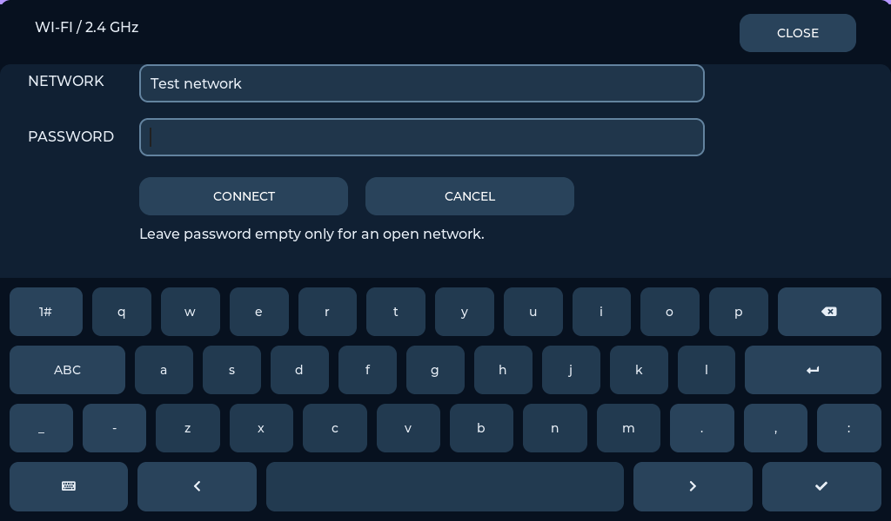

# Wi-Fi settings

[Home](../README.md) · [Pedalboard](PEDALBOARD_GUIDE.md)

The **SETTINGS → WI-FI** page controls the onboard ESP32-C6 station through
ESP-Hosted. This is a network connection feature only: it does not start a
web server, expose audio control, download effects or enable Bluetooth.

1. Open Wi-Fi. The page scans nearby **2.4 GHz** networks.
2. Select a network and enter its password on the touch keyboard. Use
   8–63 bytes for a personal WPA passphrase; leave it empty only for an open
   network. Enterprise/EAP, captive portals and 64-character raw PSKs are
   not supported by this first UI.
3. Press **CONNECT**. Failed authentication/timeouts remain visible; no
   credentials are printed by the settings component.
4. Reopen Wi-Fi to see connection state and the assigned **IPv4 address**.
5. **SCAN / CHANGE NETWORK** lets you choose another network; selecting a
   new connection disconnects the previous one. Opening the list alone does
   not intentionally disconnect a working link.
6. **DISCONNECT** stops the station and suppresses reconnect for this session.
   **Reconnect automatically** enables bounded 2–30 second retry backoff on
   link loss and restoration of the saved network after reboot. When unchecked,
   manual connection still works, but link loss requires a manual retry.




Credentials are saved only after a successful DHCP connection in the P4 NVS
namespace `p4_wifi`. The reconnect preference is also stored there. The project
does **not** enable flash/NVS encryption: someone with physical flash access
can recover the password. Passwords are never written to microSD or Git.
Closing/cancelling the password form clears its visible text.

## Hardware and software

- P4 ↔ C6: **SDMMC slot 1**, CLK18 / CMD19 / D0=14 / D1=15 / D2=16 /
  D3=17, C6 reset54, 4-bit SDIO at 40 MHz.
- microSD stays on **slot 0**, GPIO39–44; Seed3 keeps its existing SPI/UART.
- ESP-IDF **5.5.5**, `esp_wifi_remote` **1.2.5**, `esp_hosted` **1.4.7**.
  Pins/versions are explicit and P4 remains a **rev1.x** build.
- C6 must contain compatible ESP-Hosted SDIO firmware. The P4 image does not
  flash C6. If transport/scan fails, inspect the serial log before replacing
  C6 firmware; do not use a P4 image on the C6.

Official references: [Waveshare board](https://docs.waveshare.com/ESP32-P4-WIFI6-Touch-LCD-7B),
[Waveshare Wi-Fi example manifest](https://github.com/waveshareteam/ESP32-P4-WIFI6-Touch-LCD-7B/blob/main/examples/esp-idf/05_wifistation/main/idf_component.yml),
[Espressif ESP-Hosted](https://github.com/espressif/esp-hosted-mcu).

## Components and behavior

`p4_wifi_settings` owns commands, status, scan results, retry scheduling and
NVS. `p4_audio_dashboard/wifi_view.*` only submits nonblocking commands and
reads snapshots. Its 500 ms refresh does nothing while hidden. Scans retain
at most 16 distinct nonempty SSIDs from the strongest 16 AP records.

The settings worker runs at priority 2 on core 1. The pinned upstream Hosted
library additionally creates its own transport/RPC tasks at priority 23;
it is **not** correct to describe all networking as low-priority. Concurrent
network-throughput stress and 96 kHz duplex require separate qualification.
The current UI does not run background scans or generate application traffic.

The upstream Hosted transport initializes at startup; Wi-Fi station/scanning
starts only on a settings request or saved-network auto-connect. The checked
SDK tolerates repeated SDMMC host init and uses separate slots for C6/card.

For local diagnostics (SSID/password/IP are deliberately omitted):

```powershell
python tools/audio_control.py --command 'wifi scan' --seconds 12
python tools/audio_control.py --command 'wifi status' --seconds 3
```

See [verification and remaining hardware checks](PEDALBOARD_DIRECT_PATCH_TEST.md).
