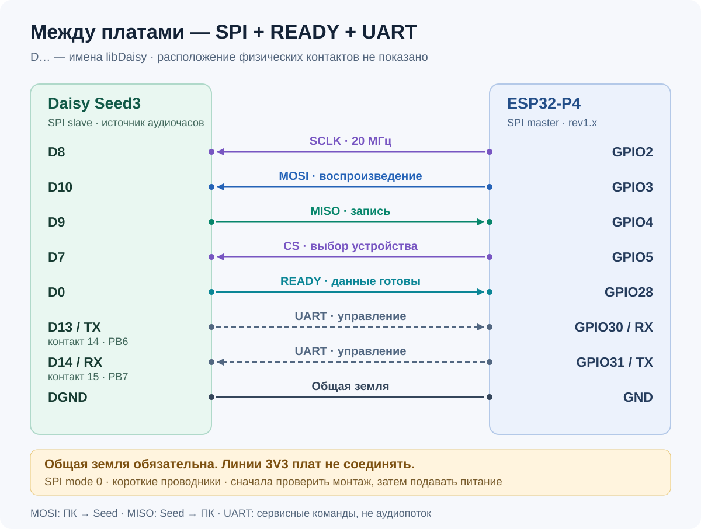
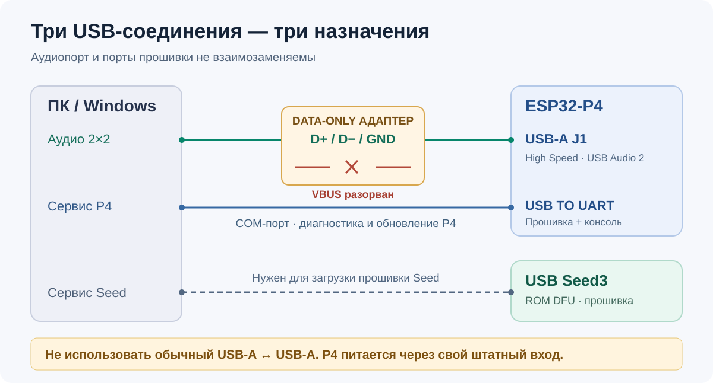

# Подключение Seed3 и ESP32-P4

[← Главная](../README.md) · [Прошивка плат](../FLASHING_RU.md)

Актуально для **v0.2.1, PCM24 2×2, 44,1–96 кГц**. Между платами используются
**SPI + READY + UART**. Назначения сверены с исходниками обеих прошивок.

> [!WARNING]
> Выполняйте монтаж при отключённом питании. Соедините DGND Seed и GND P4,
> но не соединяйте их линии 3V3. USB-A J1 нельзя подключать обычным A↔A кабелем:
> необходим проверенный data-only адаптер с физическим разрывом VBUS.

## 1. Сигналы между платами

На рисунке показаны **соединения сигналов**, не вид разъёмов сверху.
`D8` — имя вывода Seed, а не восьмой физический контакт. `GPIO2` — номер GPIO
P4, а не второй контакт разъёма. Сверяйте маркировку и ревизию своей платы.

| Сигнал | Seed3 | P4 | Источник → приёмник |
| :--- | :--- | :--- | :--- |
| SPI SCLK | D8 | GPIO2 | P4 → Seed |
| SPI MOSI / playback | D10 | GPIO3 | P4 → Seed |
| SPI MISO / capture | D9 | GPIO4 | Seed → P4 |
| SPI CS | D7 | GPIO5 | P4 → Seed |
| READY | D0 | GPIO28 | Seed → P4 |
| UART TX Seed | D13 | GPIO30 / RX | Seed → P4 |
| UART RX Seed | D14 | GPIO31 / TX | P4 → Seed |
| Общая земля | DGND | GND | Общее соединение |

P4 — **SPI master**, Seed — **SPI slave**. При этом аудиочасы принадлежат Seed:
его callback и сигнал READY определяют темп обмена. UART служит для диагностики,
`seed reset` и `seed boot`, а не для передачи PCM.

Используйте короткие проводники и надёжную общую землю. На 20 МГц длинные
макетные провода требуют отдельной проверки целостности сигналов.

| Частота звука | Кадров в SPI-пакете | Транзакций/с |
| :--- | ---: | ---: |
| 44,1 кГц | 32 | 1 378,125 |
| 48 кГц | 32 | 1 500 |
| 88,2 кГц | 32 | 2 756,25 |
| 96 кГц | 32 | 3 000 |

SPI mode 0, SCLK 20 МГц. Layout пакета и контроль CRC описаны в
[spi_audio_protocol.h](../protocol/spi_audio_protocol.h).

## 2. USB и питание

| Подключение | Назначение | Важно |
| :--- | :--- | :--- |
| ПК ↔ P4 **USB-A J1** | USB HS UAC2, capture + playback | D+, D−, GND; VBUS между ПК и P4 разорван |
| ПК ↔ P4 **USB TO UART** | Прошивка P4, консоль, диагностика | Сейчас COM6; фактический порт проверьте в Windows |
| ПК ↔ **USB Seed3** | ROM DFU 0483:df11 | Нужен для записи Seed; приложение не использует его как аудиокарту |

P4 должен получать питание через свой штатный вход согласно документации
платы; аудиокабель с разрывом VBUS не является источником питания P4.
Не объединяйте через него питающие выходы ПК и платы. До подключения
проверьте отсутствие сквозного соединения VBUS у адаптера и отсутствие замыканий.

На P4 есть отдельные Type-C **USB TO UART** и **USB1.1 FS**. Для этого проекта
используйте USB TO UART для прошивки, а Type-A J1 — для HS-аудио.
Назначение физических USB-разъёмов подтверждено
[документацией Waveshare](https://docs.waveshare.com/ESP32-P4-WIFI6-Touch-LCD-7B#hardware-description).
Схема data-only соединения выше относится к данному стенду, а не к обычному
комплектному USB-кабелю производителя.

## 3. Проверка перед первым запуском

- [ ] Платы отключены на время монтажа; DGND/GND соединены.
- [ ] Линии 3V3 двух плат не объединены.
- [ ] Все восемь соединений соответствуют таблице; TX идёт на RX.
- [ ] Разрыв VBUS у адаптера проверен; обычный A↔A кабель не используется.
- [ ] Прошиты обе платы; образ P4 предназначен для rev1.x.
- [ ] Windows видит запись и воспроизведение `usb uac` без Code 10.
- [ ] При тесте выбран один общий sample rate; `mounted=1`, `hs=1`.
- [ ] Во время непрерывного прогона не растут CRC/sequence и USB error counters.

На готовой прошивке capture — **АЦП L/R**. Синусы 997/1501 Гц включаются
только диагностической настройкой `kUseTestTones = true` с пересборкой Seed.

## Сверка с кодом

- [P4: GPIO, SPI master и UART](../ESP32-P4-WIFI6-Touch-LCD-7B/main/main.c).
- [Seed: SPI slave, READY и UART](../Seed3/src/main.cpp).
- [Форматы USB, результаты и ограничения](PCM24_ONLY_RU.md).

> [!NOTE]
> Ранняя проводка I²S/SAI2 с D25–D28 относится к старым экспериментам.
> Для текущих SPI-образов она не подходит. Не смешивайте две схемы.
